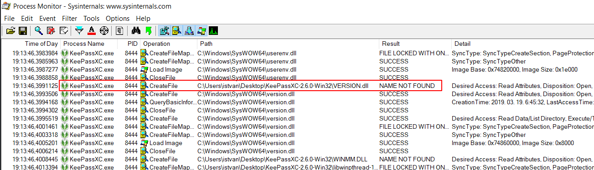

# DLL Search Order
[Dynamic-Link Library Search Order - Win32 apps | Microsoft Docs](https://docs.microsoft.com/en-us/windows/win32/dlls/dynamic-link-library-search-order)
- 如果同名 DLL 已存在就不再加载（即使目录不一样）
- *即使加载时指定了路径，加载子依赖 DLL 时依然会只用名称进行搜索*
  - 跨目录加载 DLL 时应使用 SetDllDirectory 或者 LOAD_WITH_ALTERED_SEARCH_PATH
- HKEY_LOCAL_MACHINE\SYSTEM\CurrentControlSet\Control\Session Manager\KnownDLLs
- SafeDllSearchMode（默认，当前<系统）
  1. 程序所在目录
  2. GetSystemDirectory
  3. GetWindowsDirectory
  4. GetCurrentDirectory
  5. PATH
- Not SafeDllSearchMode（当前>系统）
  1. 程序所在目录
  2. *GetCurrentDirectory*
  3. GetSystemDirectory
  4. GetWindowsDirectory
  5. PATH

## Alternate Search Order
LoadLibraryEx with LOAD_WITH_ALTERED_SEARCH_PATH

相当于将“程序所在目录”替换为了指定的目录

## SetDllDirectory
- SetDllDirectory、AddDllDirectory
- *子进程会继承父进程的 SetDllDirectory*
- 调用 SetDllDirectory 会关闭 SafeDllSearchMode
- 顺序：
  1. 程序所在目录
  2. GetDllDirectory
  3. GetSystemDirectory
  4. GetWindowsDirectory
  5. PATH
- SetDllDirectory 会取消掉对 CurrentDirectory 的搜索？

## Security
[Dynamic-Link Library Security - Win32 apps | Microsoft Docs](https://docs.microsoft.com/en-us/windows/win32/dlls/dynamic-link-library-security)
- 调用 LoadLibrary、CreateProcess、ShellExecute 时应指定路径
- LoadLibrary 时使用 flags 控制顺序，或者使用 SetDllDirectory
- 考虑使用 DLL redirection 或者 mainfest
- 不要使用 SearchPath 来获取 DLL 的路径，除非开启了 safe process search mode
- 可以使用 Process Monitor 来测验 DLL 加载的安全性

## DLL 劫持
[Triaging a DLL planting vulnerability - Microsoft Security Response Center](https://msrc-blog.microsoft.com/2018/04/04/triaging-a-dll-planting-vulnerability/)

[2019 year-end link clearance: The different kinds of DLL planting | The Old New Thing](https://devblogs.microsoft.com/oldnewthing/20191231-00/?p=103282)

### 劫持方法
**[Adaptive DLL Hijacking -- Silent Break Security](https://silentbreaksecurity.com/adaptive-dll-hijacking/)**

1. Export Forwarding（导出转发）

   通过 .def/链接器参数 重定向导出

   可以指定绝对路径（但只有链接器参数支持？）（但不能同时指定名称和序号？）

   [tothi/dll-hijack-by-proxying: Exploiting DLL Hijacking by DLL Proxying Super Easily](https://github.com/tothi/dll-hijack-by-proxying)

   [kevinalmansa/DLL\_Wrapper: A program that generates code to implement a DLL Proxy.](https://github.com/kevinalmansa/DLL_Wrapper)

   C#：[Flangvik/SharpDllProxy: Retrieves exported functions from a legitimate DLL and generates a proxy DLL source code/template for DLL proxy loading or sideloading](https://github.com/Flangvik/SharpDllProxy)

2. Run Time Linking（运行时跳转）

   [Yonsm/AheadLib: Fake DLL Source Code Generator](https://github.com/Yonsm/AheadLib)
   - [strivexjun/AheadLib-x86-x64: hijack dll Source Code Generator. support x86/x64](https://github.com/strivexjun/AheadLib-x86-x64)
   - [技术分享 - 基于AheadLib工具进行DLL劫持](https://www.write-bug.com/article/1883.html)

   [blaquee/dll-hijack: A template to hijack version.dll.](https://github.com/blaquee/dll-hijack)

3. Stack Patching

   修改 LoadLibrary 返回值，只适用于 LoadLibrary 加载的 DLL。

   [一种通用Dll劫持技术研究 | Anhkgg'Lab | Windows Kernel | Rootkit | Reverse Engineer | Expolit | 内核研究 | 逆向分析 | 漏洞分析挖掘](https://anhkgg.com/dllhijack/)
   - [SuperDllHijack/README-zh\_CN.md at master - anhkgg/SuperDllHijack](https://github.com/anhkgg/SuperDllHijack/blob/master/README-zh_CN.md)

4. Run-Time Generation

   动态修改 IAT？

### Detect
1. Process Monitor

   