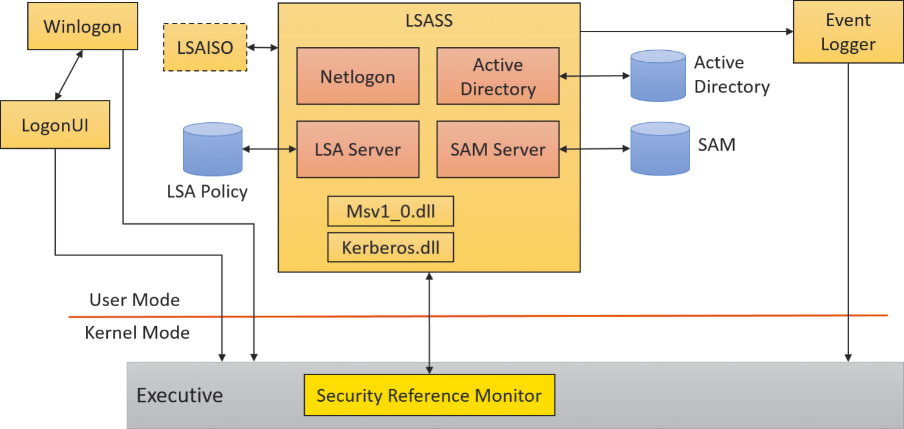

# Security
## Security system components
[^winter]

- Security reference monitor (SRM)
  
  This component in the Windows executive (Ntoskrnl.exe) is responsible for defining the access token data structure to represent a security context, performing security access checks on objects, manipulating privileges (user rights), and generating any resulting security audit messages.
- Local Security Authority Subsystem Service (LSASS)
  
  This user-mode process runs the image `Lsass.exe` that is responsible for the local system security policy (such as which users are allowed to log on to the machine, password policies, privileges granted to users and groups, and the system security auditing settings), user authentication, and sending security audit messages to the event log. The Local Security Authority service (`Lsasrv.dll`), a library that Lsass loads, implements most of this functionality.
- [Credential Guard (LSAIso.exe)](Virtualization.md#credential-guard)
  
  This is used by Lsass (if so configured on supported Windows 10 and Server 2016 systems) to store users’ token hashes instead of keeping them in Lsass’s memory. Because Lsaiso.exe is a Trustlet (Isolated User Mode process) running in VTL 1, no normal process - not even the normal kernel - can access the address space of this process. Lsass itself stores an encrypted blob of the password hash needed when it communicates with Lsaiso (via ALPC).
- Lsass policy database
  
  This database contains the local system security policy settings. It is stored in the registry in an ACL-protected area under `HKLM\SECURITY`. It includes such information as what domains are entrusted to authenticate logon attempts, who has permission to access the system and how (interactive, network, and service logons), who is assigned which privileges, and what kind of security auditing is to be performed. The Lsass policy database also stores “secrets” that include logon information used for cached domain logons and Windows service user-account logons.
- Security Accounts Manager (SAM)
  
  This service is responsible for managing the database that contains the user names and groups defined on the local machine. The SAM service, which is implemented in `Samsrv.dll`, is loaded into the Lsass process.
- SAM database
  
  This database contains the defined local users and groups along with their passwords and other attributes. On domain controllers, the SAM does not store the domain-defined users, but stores the system’s administrator recovery account definition and password. This database is stored in the registry under `HKLM\SAM`.
- Active Directory
  
  This is a directory service that contains a database that stores information about objects in a domain. A domain is a collection of computers and their associated security groups that are managed as a single entity. Active Directory stores information about the objects in the domain, including users, groups, and computers. Password information and privileges for domain users and groups are stored in Active Directory, which is replicated across the computers that are designated as domain controllers of the domain. The Active Directory server, implemented as `Ntdsa.dll`, runs in the Lsass process. For more information on Active Directory.
- Authentication packages
  
  These include dynamic link libraries (DLLs) that run in the context of both Lsass process and client processes and implement Windows authentication policy. An authentication DLL is responsible for authenticating a user by checking whether a given user name and password match (or whatever mechanism was used to provide credentials), and if so, returning to Lsass information detailing the user’s security identity, which Lsass uses to generate a token.
- Interactive logon manager (Winlogon)
  
  This is a user-mode process running `Winlogon.exe` that is responsible for responding to the SAS and for managing interactive logon sessions. Winlogon creates a user’s first process when the user logs on, for example.
- Logon user interface (LogonUI)
  
  This is a user-mode process running the image `LogonUI.exe` that presents users with the user interface they can use to authenticate themselves on the system. LogonUI uses credential providers to query user credentials through various methods.
- Credential providers (CPs)
  
  These are in-process COM objects that run in the LogonUI process (started on demand by Winlogon when the SAS is performed) and used to obtain a user’s name and password, smartcard PIN, biometric data (such as a fingerprint), or other identification mechanism. The standard CPs are `authui.dll`, `SmartcardCredentialProvider.dll`, `BioCredProv.Dll`, and `FaceCredentialProvider.dll`, a face-detection provider added in Windows 10.
- Network logon service (Netlogon)
  
  This is a Windows service (`Netlogon.dll`, hosted in a standard SvcHost) that sets up the secure channel to a domain controller, over which security requests - such as an interactive logon (if the domain controller is running Windows NT 4) or LAN Manager and NT LAN Manager (v1 and v2) authentication validation - are sent. Netlogon is also used for Active Directory logons.
- Kernel Security Device Driver (KSecDD)
  
  This is a kernel-mode library (`%SystemRoot%\System32\Drivers\Ksecdd.sys`) of functions that implement the advanced local procedure call (ALPC) interfaces that other kernel mode security components, including the Encrypting File System (EFS), use to communicate with Lsass in user mode.
- AppLocker
  
  This mechanism allows administrators to specify which executable files, DLLs, and scripts can be used by specified users and groups. AppLocker consists of a driver (`%SystemRoot%\System32\Drivers\AppId.sys`) and a service (`AppIdSvc.dll`) running in a standard SvcHost process.

[^winter]: Windows Internals