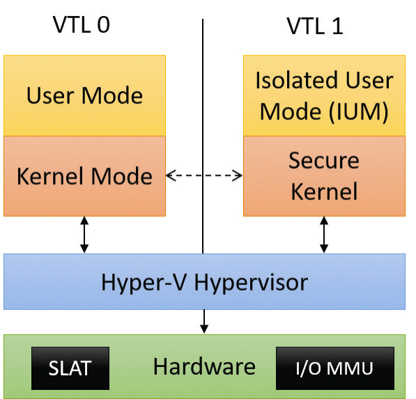

# Virtualization-Based Security
[^internals]
- [I/O memory management unit](https://en.wikipedia.org/wiki/Input%E2%80%93output_memory_management_unit)
- [Second Level Address Translation](https://en.wikipedia.org/wiki/Second_Level_Address_Translation)
- Secure boot
- Secure kernel (`securekernel.exe`)
  - Device Guard
    - Hypervisor-based Code Integrity (HVCI)
    - Kernel-Mode Code Integrity (KMCI)
  - Credential Guard
    - LSA (`Lsass.exe`)
    - Isolated LSA (`LsaIso.exe`)
- Isolated user mode (`Iumdll.dll` and `Iumbase.dll`, the VTL 1 version of `Ntdll.dll` and `Kernelbase.dll`)
  - Trustlets

[^internals]: *Windows Internals*

## Credential Guard
Credentials:
- Password
- NT one-way function (used by the NT LAN Manager protocol)
- Ticket-granting ticket (used by the Kerberos protocol)

## Performance impacts
VBS can cause performance drops of 5% to 30%.[^pcgamer][^toms]

[^pcgamer]: [Windows 11 will hobble gaming performance by default on some prebuilt PCs | PC Gamer](https://www.pcgamer.com/windows-11-pcs-can-hobble-gaming-performance/)
[^toms]: [Benchmarked: Do Windows 11’s Security Features Really Hobble Gaming Performance? | Tom's Hardware](https://www.tomshardware.com/news/windows-11-gaming-benchmarks-performance-vbs-hvci-security)

## Configuration
[^ms-integrity][^ms-credential]
- `HKEY_LOCAL_MACHINE\SYSTEM\CurrentControlSet\Control`
  - DeviceGuard
    - EnableVirtualizationBasedSecurity
    - RequirePlatformSecurityFeatures
    - Scenarios
      - HypervisorEnforcedCodeIntegrity
      - CredentialGuard
  - Lsa
    - LsaCfgFlags
- Group Policy (`gpedit.msc`)
  - Computer Configuration/Administrative Templates/System/Device Guard
    - Turn on Virtualization Based Security
      - Select Platform Security Level (Secure Boot and DMA Protection)
      - Virtualization Based Protection of Code Integrity
      - Credential Guard Configuration

To disable VBS without disabling Hyper-V, run the following commands after turning off all VBS Group Policy and registry settings[^ms-credential][^disable-ms-qa][^disable-su]:
```cmd
mountvol X: /s
copy %WINDIR%\System32\SecConfig.efi X:\EFI\Microsoft\Boot\SecConfig.efi /Y
bcdedit /create {0cb3b571-2f2e-4343-a879-d86a476d7215} /d "Disable VBS" /application osloader
bcdedit /set {0cb3b571-2f2e-4343-a879-d86a476d7215} path "\EFI\Microsoft\Boot\SecConfig.efi"
bcdedit /bootsequence {0cb3b571-2f2e-4343-a879-d86a476d7215}
bcdedit /set {0cb3b571-2f2e-4343-a879-d86a476d7215} loadoptions DISABLE-VBS
bcdedit /set vsmlaunchtype off
bcdedit /set {0cb3b571-2f2e-4343-a879-d86a476d7215} device partition=X:
mountvol X: /d
```
However, while `bcdedit /bootsequence` works, `bcdedit /default` does not, which means we can only disable VBS for the next boot. A workaround is to use Task Manager to run `bcdedit.exe /bootsequence {0cb3b571-2f2e-4343-a879-d86a476d7215}` after every boot.

At boot you should see the "Virtualization Based Security Opt-out Tool" asking you whether to disable VBS. Press Win or F3 to continue and reboot to the real system.

[^disable-ms-qa]: [Disable Virtualization-Based Security Without Disabling Hyper-V - Microsoft Q&A](https://docs.microsoft.com/en-us/answers/questions/245071/disable-virtualization-based-security-without-disb.html)
[^disable-su]: [hyper v - Windows 10: Permanently disable VBS (Virtualization-based security)? - Super User](https://superuser.com/questions/1489224/windows-10-permanently-disable-vbs-virtualization-based-security)

[^ms-integrity]: [Enable virtualization-based protection of code integrity - Windows security | Microsoft Docs](https://docs.microsoft.com/en-us/windows/security/threat-protection/device-guard/enable-virtualization-based-protection-of-code-integrity)
[^ms-credential]: [Manage Windows Defender Credential Guard (Windows) - Windows security | Microsoft Docs](https://docs.microsoft.com/en-us/windows/security/identity-protection/credential-guard/credential-guard-manage)